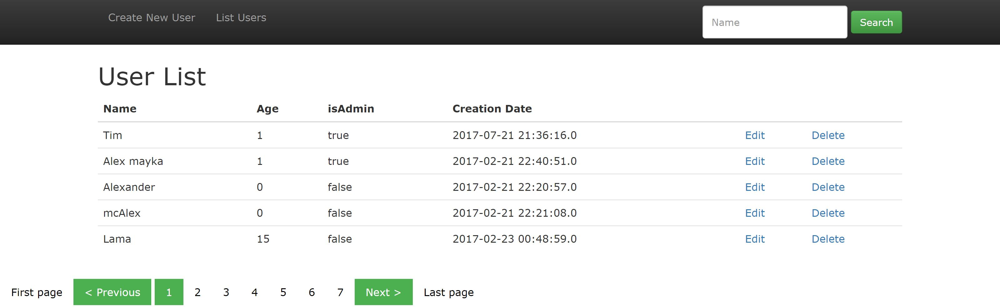

# Implementation of a simple CRUD Web application.

  

The application with search by name and paging.  
Fields:
 * Name
 * Age
 * Is the user an administrator?
 * Date of record creation

## Installing the application

Install [Tomcat](tomcat.apache.org), [JDK](http://www.oracle.com/technetwork/java/javase/downloads/jdk8-downloads-2133151.html) and [MySQL](https://dev.mysql.com/downloads/mysql/) on your computer.

Parameters of a database set in src\main\resources\application.properties.  
Example:
* db.driver=com.mysql.jdbc.Driver
* db.url=jdbc:mysql://localhost:3306/test_db
* db.username=dbUser
* db.password=dbPass

The script for creating a table and filling it in UserSQL.sql

## Running the application

1) your/project/path/target/crud-1.war copy to path/of/tomcat/webapps: 
2) Start Tomcat

Open the application in the browser at: http://localhost:8080/crud-1/list/1
